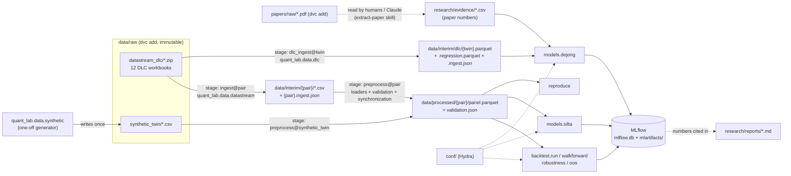
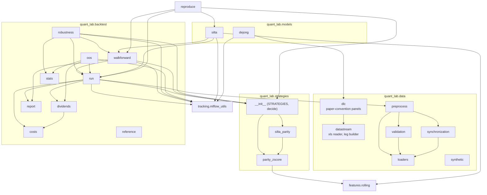
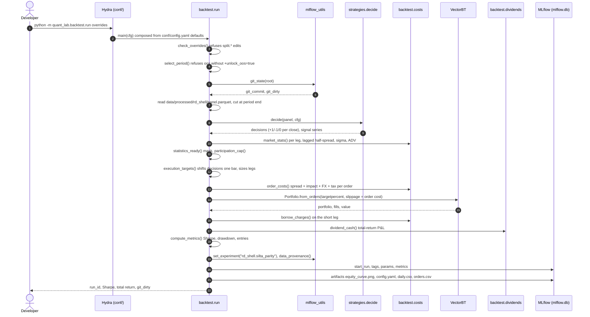
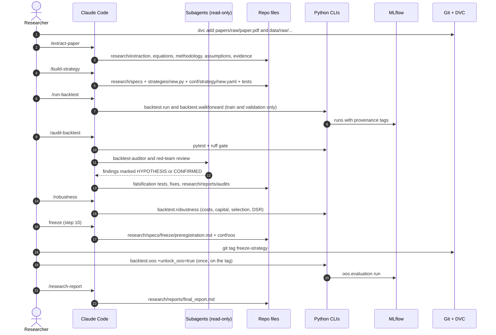

# quant-lab: System Architecture & Control Flow

Deliverable 1 of the developer hand-over: what the system is, how data and
control move through it, and every entry point. The companion operating manual
is [OPERATIONS.md](OPERATIONS.md).

Written 2026-10-07 against commit `a847032` (branch `claude/sharp-bohr-snz350`,
ROADMAP step 14 done).

## Contents

- [1. Summary](#1-summary)
- [2. Layered view](#2-layered-view)
- [3. Diagrams](#3-diagrams)
  - [3.1 Data pipeline (DVC)](#31-data-pipeline-dvc)
  - [3.2 Code modules and their dependencies](#32-code-modules-and-their-dependencies)
  - [3.3 Sequence: one backtest run](#33-sequence-one-backtest-run)
  - [3.4 Sequence: research lifecycle, paper to OOS verdict](#34-sequence-research-lifecycle-paper-to-oos-verdict)
- [4. Component reference](#4-component-reference)
- [5. Entry points](#5-entry-points)
- [6. Guards and invariants](#6-guards-and-invariants)
- [7. Data and record contracts](#7-data-and-record-contracts)
- [8. Known structural issues](#8-known-structural-issues)

---

## 1. Summary

**What it is.** A single-user quantitative research lab that turns academic
finance papers into reproducible, audited, testable trading research. It is
not a trading system: nothing connects to a broker or runs live.

| | |
|---|---|
| Papers | Maymin, *Self-Imposed Limits to Arbitrage* (steps 1-12, finished: negative, pre-registered OOS result). de Jong, Rosenthal & van Dijk (2009), *The Risk and Return of Arbitrage in Dual-Listed Companies* (steps 13+, in progress) |
| Data | Licensed Datastream/Bloomberg workbooks for 12 dual-listed companies (DLCs), 1975-2002, kept in DVC. A deterministic synthetic twin pair for tests |
| Language and runtime | Python 3.12 (pinned), managed by uv |
| Data versioning | DVC 3.x: `dvc add` for raw data, `dvc.yaml` stages for derived data; the local remote lives outside the repo |
| Configuration | Hydra / OmegaConf (`conf/`) |
| Experiment tracking | MLflow 3.x, sqlite backend `mlflow.db`, artifacts in `mlartifacts/` |
| Backtesting | VectorBT `Portfolio.from_orders`, reconciled against an independent pandas ledger |
| Econometrics | numpy, scipy and statsmodels; Newey-West implemented in-house to match R `sandwich` |
| Quality | pytest (about 290 tests in four tiers), ruff, GitHub Actions CI on synthetic data |
| AI layer | Claude Code: `CLAUDE.md` rules, 6 project skills, 6 subagents, a Bash guard hook, permission deny-list |

**Scale:**

- about 3,300 lines in `src/quant_lab` (33 files, 3 of them empty
  placeholders);
- 43 test files;
- 30 YAML config files;
- 22 research Markdown notes and reports;
- 50 commits.

**How to read it.** The repository is organised around one rule set
(`CLAUDE.md`):

1. Research fidelity.
2. Reproducibility.
3. No look-ahead.
4. Realistic execution.
5. Statistical validity.

Most of the code exists to enforce those: guards, provenance tags, structural
tests and a pre-registered out-of-sample (OOS) protocol.

## 2. Layered view

| Layer | Path | Talks to |
|---|---|---|
| Raw inputs (immutable) | `data/raw/`, `papers/raw/` (DVC) | read by the data stages only |
| Data stages | `src/quant_lab/data/` | read raw files, write `data/interim/` and `data/processed/` (DVC outs) |
| Configuration | `conf/` (Hydra groups) | read by every entry point |
| Signals and strategies | `src/quant_lab/features/`, `src/quant_lab/strategies/` | pure functions over a panel |
| Engines | `src/quant_lab/backtest/` | panel + config → orders → VectorBT → metrics |
| Analyses | `src/quant_lab/models/`, `backtest/robustness.py`, `backtest/oos.py`, `reproduce.py` | call the engines and the data layer |
| Records | `tracking/mlflow_utils.py` → `mlflow.db` + `mlartifacts/`; `research/` (Markdown); git commits and tags | write-only sinks |
| Governance | `CLAUDE.md`, `.claude/` (skills, agents, hook, settings), `tests/`, `.github/workflows/ci.yml` | constrain everything above |

## 3. Diagrams

### 3.1 Data pipeline (DVC)

Data enters at the left and only moves right. Every box with a path is a file
on disk, and every arrow labelled `stage:` is a `dvc.yaml` stage, rebuilt by
`uv run dvc repro`.

### 3.2 Code modules and their dependencies

Arrows point from the caller to what it imports.

`backtest.reference` is imported only by tests: it is the independent ledger
that VectorBT must reconcile with.

### 3.3 Sequence: one backtest run

Command:
`uv run python -m quant_lab.backtest.run data=rd_shell strategy=silta_parity backtest.period=validation`

### 3.4 Sequence: research lifecycle, paper to OOS verdict

These are the human and AI steps that the code above serves. Slash commands
are Claude Code project skills (`.claude/skills/`); named agents are
`.claude/agents/`.

## 4. Component reference

The communication style is in-process function calls unless stated otherwise.
Files are the only inter-process channel: DVC stages, the MLflow sqlite store
and Markdown. There are no services, queues or network APIs at runtime.

### 4.1 `quant_lab.data`

| Module | Responsibility | Inputs | Outputs | Communicates via |
|---|---|---|---|---|
| `datastream` | Read the legacy `.xls` inside the zips without extracting them. Repair the dd/mm vs mm/dd dates. Locate columns by exact header label. Build the lab's per-leg raw schema (GBP, shares, total-return `adj_close`, holiday rows dropped) | `data/raw/datastream_dlc/*.zip`, `conf/data/<pair>.yaml` | `data/interim/<pair>/<SYMBOL>.csv`, `data/interim/<pair>.ingest.json` | DVC stage `ingest`; `read_sheet` and `Sheet.column` reused by `dlc` |
| `dlc` | Paper-convention twin panel for de Jong et al.: all workbook rows in the paper's window, d_t rebuilt and checked against the authors' column (1e-9); the regression sheet's Table III inputs, returns checked against the panel (1e-9) | zips, `conf/dlc/<twin>.yaml` | `data/interim/dlc/<twin>.parquet`, `<twin>.regression.parquet`, `.ingest.json` | DVC stage `dlc_ingest`; read by `models.dejong` |
| `loaders` | Load one `<SYMBOL>.csv`, enforce required columns, no silent fixing | raw CSV | DataFrame | called by `preprocess` |
| `validation` | Deterministic data checks: OHLC consistency, dates, gaps, jumps, quotes, turnover plausibility, pair coverage | per-leg frames | `Issue` list; raises `DataValidationError` | called by `preprocess`; asserted in `tests/data/` |
| `synchronization` | Align two legs on common dates (`drop` or `ffill` with limit), stale flags | two frames | pair panel | called by `preprocess` |
| `preprocess` | Stage driver: load, validate, align, write the panel and metrics | `conf/data/<dataset>.yaml`, raw or interim CSVs | `data/processed/<dataset>/panel.parquet`, `validation.json` | DVC stage `preprocess`; `PANEL_FILE` constant imported by every engine |
| `synthetic` | Generate the synthetic twin (GBM fundamental + OU mispricing, known truth) | `conf/data/synthetic_twin.yaml` | `data/raw/synthetic_twin/*.csv` (refuses to overwrite) | CLI, and tests (in tmp dirs) |
| `cleaning`, `corporate_actions` | Empty placeholders | none | none | none |

### 4.2 `quant_lab.features` and `quant_lab.strategies`

| Module | Responsibility | Inputs | Outputs | Communicates via |
|---|---|---|---|---|
| `features.rolling` | Trailing z-score (causal) | Series, window | Series | imported by `parity_zscore` and `models.silta` |
| `strategies.__init__` | Registry `STRATEGIES = {name: decide}` and dispatcher `decide(panel, cfg)` on `cfg.strategy.name` | panel, composed cfg | (positions, signal) | called by `run`, `walkforward`, `reproduce`; `robustness` reads `STRATEGIES` |
| `strategies.parity_zscore` | Baseline: z-score of ln(Pa/Pb), hysteresis entry/exit | panel, `strategy.{window,entry_z,exit_z}` | +1/-1/0 per close, z | via the registry |
| `strategies.silta_parity` | SILTA arbitrageur: deviation from `data.parity_ratio`, enter beyond the bound, exit at parity | panel, `strategy.{entry_bound,exit_bound}`, `data.parity_ratio` | positions, deviation | via the registry |

A strategy only decides positions at each close. Timing, sizing and costs are
applied once, in `backtest.run`.

### 4.3 `quant_lab.backtest`

| Module | Responsibility | Inputs | Outputs | Communicates via |
|---|---|---|---|---|
| `run` | Hydra entry point and the core engine: guards, `execution_targets` (one-bar lag, sizing, caps), `simulate` (VectorBT), `backtest_pair` (costs, borrow, dividends), metrics, MLflow logging | cfg, panel | MLflow run; result dict incl. equity and held | imported by every analysis module |
| `costs` | Liquidity costs per order (half-spread, square-root impact, FX, buy tax), borrow, participation cap, `statistics_ready` warm-up mask; all statistics as of the decision close | panel, `conf/costs/*.yaml` | cost frames | called by `run` |
| `dividends` | Implied dividends from the total-return series; holder-of-record cash with withholding on longs | panel, positions | daily dividend cash | called by `run`, `oos` |
| `reference` | Independent pandas replay of fills and equity | VectorBT order records | equity series | tests only (`tests/integration/test_reconciliation.py`) |
| `report` | Equity-curve PNG | equity | PNG | called by `run`, `walkforward` |
| `walkforward` | Calendar folds with embargo, grid from `strategy.grid`, neighbourhood-mean selection, stitched test equity | cfg, panel | MLflow run (`kind=walkforward`), folds and grid CSVs | called by `robustness`, `reproduce`, `models.silta` (`development_range`) |
| `stats` | PSR, DSR, expected max Sharpe, sub-periods, calendar years, causal volatility regimes, trade concentration | return series | dicts and frames | called by `robustness`, `oos` |
| `robustness` | Runs every case in `conf/robustness/` (walk-forward + frozen train/validation), counts trials from MLflow, logs a summary | cfg, panel, MLflow store | MLflow runs + summary (`<data>.robustness`) | calls `walkforward`, `run`, `stats`; reads MLflow |
| `oos` | Pre-registered one-shot OOS evaluation; requires `+unlock_oos=true`, a clean tree and a `freeze-*` tag on HEAD | `conf/oos/default.yaml`, panels | MLflow `oos.evaluation` + backtest runs | calls `run`, `stats`, `dividends`; reads `git tag` |
| `splits` | Empty placeholder | none | none | none |

### 4.4 `quant_lab.models`, `reproduce`, `tracking`

| Module | Responsibility | Inputs | Outputs | Communicates via |
|---|---|---|---|---|
| `models.silta` | Maymin's price-volume regressions, Newey-West (R `sandwich` defaults), the chi > 0 check, lag sensitivity; development windows only | cfg, panel | MLflow `<data>.silta` + CSV artifacts | Hydra CLI; imports guards from `backtest.run` |
| `models.dejong` | de Jong et al. Table II (deviation statistics) and Table III (comovement regression E2, EViews-style Newey-West; variants `identified` and `as_stated`) vs the paper's values from the evidence CSV | `conf/dlc/*`, DLC panels and regression data, `research/evidence/dejong_dlc_evidence.csv` | MLflow `dejong.replication/table2`, `/table3` + CSV | plain CLI (reads `conf/config.yaml` for MLflow settings) |
| `reproduce` | Recompute 10 headline development numbers without logging; compare with `research/reports/headlines.yaml` | panels, configs | exit code 0/1, printed table | CLI; used in `tests/integration/test_reproduce.py` |
| `tracking.mlflow_utils` | `git_state`, `file_md5`, `dvc_locked_md5`, `data_provenance`, `flatten`, `set_experiment` | repo root, `dvc.lock` | tag dicts | imported by every logging module |

### 4.5 Governance components

| Component | Responsibility | How it acts |
|---|---|---|
| `CLAUDE.md` | Lab rules for any AI agent | loaded into every Claude Code session |
| `.claude/settings.json` | Deny edits to `data/raw`, `papers/raw`, `dvc.lock`, `uv.lock`; deny force-push and `dvc gc`; ask before editing hooks and settings | Claude Code permission engine |
| `.claude/hooks/guard_bash.py` | PreToolUse hook: block shell in-place edits and redirects into protected paths (`src/ tests/ conf/ data/raw/ papers/raw/ .claude/ .dvc/` and key files) | stdin JSON → deny or ask (pinned by `tests/unit/test_bash_guard.py`) |
| `.claude/skills/*` | Workflows: extract-paper, build-strategy, run-backtest, audit-backtest, robustness, research-report | `/name` in Claude Code |
| `.claude/agents/*` | 5 read-only reviewers (backtest-auditor, red-team, paper-reader, quant-researcher, robustness-researcher) + strategy-engineer (can Edit) | launched by skills or on request |
| `tests/` | `unit`, `data`, `structural` (look-ahead perturbation + mutation checks), `integration` (end-to-end, reconciliation, real-data pins) | pytest |
| `.github/workflows/ci.yml` | ruff + pytest on synthetic data; fails if data files are tracked | GitHub Actions on push and PR |

## 5. Entry points

Every command runs from the repository root. Each one reads `conf/` and
writes only the paths listed.

| # | Command | Invokes downstream | Writes |
|---|---|---|---|
| E1 | `uv run dvc repro` (or `dvc repro <stage>`) | `ingest@{rd_shell,reed_elsevier,rio_tinto}` → `data.datastream.main`; `dlc_ingest@<12 twins>` → `data.dlc.main`; `preprocess@{synthetic_twin,rd_shell,reed_elsevier,rio_tinto}` → `data.preprocess.main` | `data/interim/**`, `data/processed/**`, `dvc.lock` |
| E2 | `uv run python -m quant_lab.data.synthetic --dataset synthetic_twin` | `simulate_truth` → `generate_pair` → `write_raw` | `data/raw/synthetic_twin/` (once; then `dvc add`) |
| E3 | `uv run python -m quant_lab.data.datastream --dataset <pair>` | `read_sheet`, `build_leg` | `data/interim/<pair>/` (prefer E1) |
| E4 | `uv run python -m quant_lab.data.dlc --twin <twin>` | `read_sheet`, `assemble` | `data/interim/dlc/<twin>.parquet` (prefer E1) |
| E5 | `uv run python -m quant_lab.data.preprocess --dataset <name>` | `load_symbol`, `check_ohlcv`, `align_pair` | `data/processed/<name>/` (prefer E1) |
| E6 | `uv run python -m quant_lab.backtest.run data=<pair> strategy=<name> [backtest.period=train\|validation]` | see the sequence in 3.3 | MLflow `<pair>.<strategy>` |
| E7 | `uv run python -m quant_lab.backtest.run -m strategy.window=40,60,80` | Hydra multirun of E6 | one MLflow run per value; `multirun/` |
| E8 | `uv run python -m quant_lab.backtest.walkforward data=<pair> strategy=<name>` | `make_folds` → `evaluate` per grid point → `backtest_pair` | MLflow `<pair>.<strategy>` (`kind=walkforward`) |
| E9 | `uv run python -m quant_lab.backtest.robustness data=<pair>` | `run_walk_forward` + `run_backtest` per case; `count_trials`; `stats.*` | MLflow runs + `<pair>.robustness` |
| E10 | `uv run python -m quant_lab.backtest.oos +unlock_oos=true` | `check_ready` (tag, clean tree) → `run_backtest` × 24 → Holm, DSR, verdicts | MLflow `oos.evaluation`. **Spent**: run once at `ff1e9eb` (run `c5a6c503`) |
| E11 | `uv run python -m quant_lab.models.silta data=<pair>` | `analyse` → `regressions` (`ols_nw`) → `chi_condition`, `lag_sensitivity` | MLflow `<pair>.silta` |
| E12 | `uv run python -m quant_lab.models.dejong [--table 2\|3]` | `table2` → `deviation_stats` per twin vs `paper_table2`; `table3` → `comovement_design` → `comovement` per twin and variant vs `paper_table3` | MLflow `dejong.replication` |
| E13 | `uv run python -m quant_lab.reproduce [<dataset>]` | `measure` → `silta.analyse` / `backtest_pair` / `walk_forward` | stdout only; exit code |
| E14 | `uv run mlflow ui --backend-store-uri sqlite:///mlflow.db` | MLflow web UI | none (read) |
| E15 | `uv run pytest` / `uv run ruff check . && uv run ruff format --check .` | test tiers / lint | `.pytest_cache`, `.ruff_cache` |
| E16 | GitHub Actions `ci` (push, pull_request) | `uv sync --locked`, ruff, pytest, data-leak check | CI logs |
| E17 | Claude Code `/extract-paper`, `/build-strategy`, `/run-backtest`, `/audit-backtest`, `/robustness`, `/research-report` | skills, which call E6-E13 and subagents | research Markdown, code, MLflow runs |
| E18 | Claude Code PreToolUse hook (automatic on every Bash call) | `.claude/hooks/guard_bash.py` | allow / ask / deny |

## 6. Guards and invariants

| Invariant | Enforced by | Tested by |
|---|---|---|
| Split boundaries cannot change from the CLI | `backtest.run.check_overrides` | `test_backtest_run.py::test_split_overrides_are_refused` |
| OOS needs `+unlock_oos=true` (logged as a tag) | `select_period`, `robustness`, `oos.check_ready` | `test_oos_is_locked_by_default`, `test_oos_unlock_is_refused` |
| OOS evaluation only on frozen, clean code | `oos.check_ready` (`git tag --points-at HEAD`) | `tests/unit/test_oos.py` |
| No data after the period end reaches a signal | panel cut at `period.end`; walk-forward cuts per window | `tests/structural/*` (perturbation + mutation checks) |
| Fills one bar after the decision; cost statistics as of the decision close | `execution_targets`, `order_costs` | `test_strategy_causality.py`, `test_cost_causality.py` |
| No position before cost statistics exist; never a zero-cost order | `costs.statistics_ready`, `order_costs` raises | `test_warmup_execution.py` |
| VectorBT equals the independent ledger | `backtest.reference` | `test_reconciliation.py` |
| Every run records git commit, dirty flag and data md5 vs `dvc.lock` | `run_tags`, `data_provenance` | `test_run_logs_metrics_tags_and_artifacts` |
| Raw data immutable; locks edited only by tools | `.claude/settings.json` deny, guard hook | `test_bash_guard.py`, `test_claude_config.py` |
| Paper-2 panels reproduce the authors' deviation | `dlc.assemble` (raises) | `test_dlc.py`, `test_dejong_real.py` |
| Paper-2 regression data equals the panels' returns | `dlc.regression_panel` (raises) | `test_dejong_table3.py`, `test_dejong_real.py` |
| Headline numbers are stable | `reproduce` | `test_reproduce.py` (real data) |

## 7. Data and record contracts

**Raw per-leg CSV** (`data/interim/<pair>/<SYMBOL>.csv`, `data/raw/synthetic_twin/*.csv`):

- required: `date, close, adj_close, volume`;
- optional: `open, high, low` (all or none), `bid, ask`, `shares_outstanding`;
- see `data/loaders.py`.

**Processed panel** (`data/processed/<dataset>/panel.parquet`):

- one row per common trading date;
- columns `<field>_a` and `<field>_b` for each raw field, plus stale flags.

**DLC panel** (`data/interim/dlc/<twin>.parquet`):

- `price_a, price_b, fx, close_a, close_b, tr_a, tr_b, ratio, deviation, deviation_workbook`;
- see `data/dlc.py`.

**MLflow experiments:**

- `<data>.<strategy>`: single runs and walk-forwards;
- `<data>.silta`;
- `<data>.robustness`;
- `oos.evaluation`;
- `dejong.replication`.

**MLflow tags** on every backtest:

- `git_commit, git_dirty`;
- `data_path, data_md5, data_dvc_lock_md5, data_matches_dvc_lock`;
- `period, period_start, period_end`;
- `unlock_oos, cost_model, execution, strategy, dataset, run_label`.

**Research records** (`research/`):

- one Markdown set per paper (`<slug>.md` in `extraction/`, `equations/`,
  `methodology/`, `assumptions/`);
- the paper's numbers in `evidence/<slug>_evidence.csv`;
- results in `reports/`, decisions in `reports/data_decisions.md`, audits in
  `reports/audits/`.

## 8. Known structural issues

Found during this analysis. None of them is fixed here: each is a candidate
task.

1. **Empty placeholder modules:** `backtest/splits.py`, `data/cleaning.py`,
   `data/corporate_actions.py`. The empty `conf/features/` group and the empty
   `notebooks/` folder are similar.
2. **Inverted dependency:** `models.silta` imports guards (`check_overrides`,
   `run_tags`, `Period`) from `backtest.run`, and `development_range` from
   `backtest.walkforward`. These belong in a small shared module (for example
   `quant_lab.guards`).
3. **Two config styles:**
   - Hydra-composed `conf/config.yaml` (backtests, silta, robustness, oos);
   - plain `OmegaConf.load` for `conf/dlc/*` and `models.dejong`.

   Both work, but a new developer must know which is which (see 5).
4. **Stale README, fixed with these docs:**
   - the opening paragraph named only Maymin as the current paper;
   - the clone path was `quant-research`;
   - the example `costs.fee_bps=20` fails under the default liquidity cost
     model (it needs `costs=flat_bps`).
5. **The DVC remote is local-only:** `localstore` points to a folder on one
   machine (`~/dvc-store`). There is no off-site copy of the licensed data
   (see OPERATIONS, maintenance).
